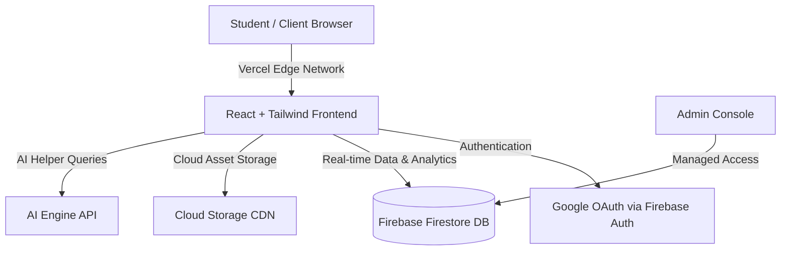

<div align="center">

  <!-- Animated Header Waving Banner -->
  

  <!-- Dynamic Typing AnimatioAn -->
  <a href="https://fycs-study-hub.vercel.app/">
    
  </a>

  <br/><br/>

  <!-- Top Badges Row -->
  <p align="center">
    <a href="https://fycs-study-hub.vercel.app/" target="_blank">
      
    </a>
    
    
    
  </p>

  <p align="center">
    <a href="#-interactive-preview">Live Preview</a> •
    <a href="#-core-features">Features</a> •
    <a href="#%EF%B8%8F-system-architecture">Architecture</a> •
    <a href="#-tech-stack">Tech Stack</a> •
    <a href="#-intellectual-property--code-access-policy">Recruiter Code Access</a> •
    <a href="#-author--contact">Contact</a>
  </p>

</div>

---

## 🌟 Overview

**BNN CS Study Hub** is a modern, high-performance academic ecosystem designed for Computer Science students. It eliminates the chaos of scattered notes and outdated files by providing semester-wise curated study resources, practical code snippets, previous year question papers (PYQs), and real-time AI assistance—all wrapped in a clean, distraction-free UI.

> [!NOTE]
> **Showcase Edition:** This repository serves as a **Public Architecture & Product Showcase**. The production source code is stored safely in a private repository to prevent unauthorized plagiarism, replication, and intellectual property theft.

---

## 🖥️ Interactive Preview

<div align="center">

  ### 🔗 [👉 Click Here to Launch Live Application 👈](https://fycs-study-hub.vercel.app/)

  <br/>

  <!-- High-Res Preview / Demo GIF Frame -->
  <a href="https://fycs-study-hub.vercel.app/" target="_blank">
    
  </a>
  
  <p><em>💡 Replace with a 10-second GIF showing seamless navigation and live features.</em></p>

</div>

---

## ✨ Core Features

<table>
  <tr>
    <td width="50%">
      <h3>📚 Smart Resource Engine</h3>
      <ul>
        <li>Organized by Semester, Subject, and Modules.</li>
        <li>Curated practical code, notes, and downloadable PYQs.</li>
        <li>Instant search and category-based filter tags.</li>
      </ul>
    </td>
    <td width="50%">
      <h3>🤖 AI Assignment Assistant</h3>
      <ul>
        <li>Integrated AI helper for debugging and query breakdown.</li>
        <li>Context-aware guidance tailored for CS syllabus.</li>
        <li>Clean response formatting with code highlights.</li>
      </ul>
    </td>
  </tr>
  <tr>
    <td width="50%">
      <h3>🔐 Admin & Secure Auth</h3>
      <ul>
        <li>Google OAuth 2.0 single-sign-on integration.</li>
        <li>Protected admin dashboard for resource publishing.</li>
        <li>Role-based access management.</li>
      </ul>
    </td>
    <td width="50%">
      <h3>📈 Real-Time Telemetry</h3>
      <ul>
        <li>Live visitor and download analytics powered by Firebase.</li>
        <li>Optimized client-side caching for zero latency.</li>
        <li>Mobile-first responsive fluid layout across devices.</li>
      </ul>
    </td>
  </tr>
</table>

---

## 🛠️ System Architecture



<details>
<summary><b>🔍 Click to expand Architecture & Tech Layer Breakdown</b></summary>
<br/>

| Layer | Technology | Purpose |
| :--- | :--- | :--- |
| **Frontend Framework** | `React.js` | Component-based, lightning fast UI rendering |
| **Styling & Design** | `Tailwind CSS` | Modern responsive dark-mode styling with custom design tokens |
| **State & Data Fetching** | `Custom React Hooks` | Synchronized Firestore real-time listeners |
| **Authentication** | `Firebase Auth` | Secure Google sign-in & JWT handling |
| **Database & Analytics** | `Cloud Firestore` | Low-latency NoSQL database for real-time analytics & resources |
| **Hosting & CDN** | `Vercel Edge` | Global edge distribution with SSL & auto-caching |

</details>

---

## 💻 Tech Stack & Tooling

<div align="center">

| Category | Technologies Used |
| :--- | :--- |
| **Core & Languages** |    |
| **Frontend UI** |    |
| **Backend & Cloud** |   |
| **Deployment** |  |

<br/>


</div>

---

## 🔒 Intellectual Property & Code Access Policy

> [!IMPORTANT]
> ### 🛡️ Notice for Public Visitors & Fellow Developers
> The underlying source code for this project contains custom algorithms, database rules, and proprietary design implementations. To prevent unauthorized replication, source code cloning, and academic plagiarism, **this repository is maintained as a closed-source showcase**.

```
┌────────────────────────────────────────────────────────────────────────┐
│  💼 FOR RECRUITERS, HIRING MANAGERS & TECHNICAL EVALUATORS             │
│                                                                        │
│  I actively welcome technical evaluation of my coding standards!       │
│  If you are evaluating my profile for internships or software roles,  │
│  I will gladly:                                                        │
│                                                                        │
│  1. Grant private repository read access to your GitHub account.       │
│  2. Conduct a live architecture & code walkthrough over Google Meet.   │
│                                                                        │
│  📩 Reach out directly: rishiuttamsahu@gmail.com                       │
└────────────────────────────────────────────────────────────────────────┘
```

---

## 👨‍💻 Author & Connect

<div align="center">

### **Rishikesh Sahu**
*Computer Science Student • Passionate Developer & Builder*

[](https://www.linkedin.com/in/rishi84/)
[](mailto:rishiuttamsahu@gmail.com)
[](https://github.com/rishiuttamsahu-lang)
[](https://www.instagram.com/itz_rishi_8468/)

<br/>

<!-- Animated Waving Footer -->


<p align="center">⭐ If you found this showcase inspiring, consider giving this repository a star!</p>

</div>
